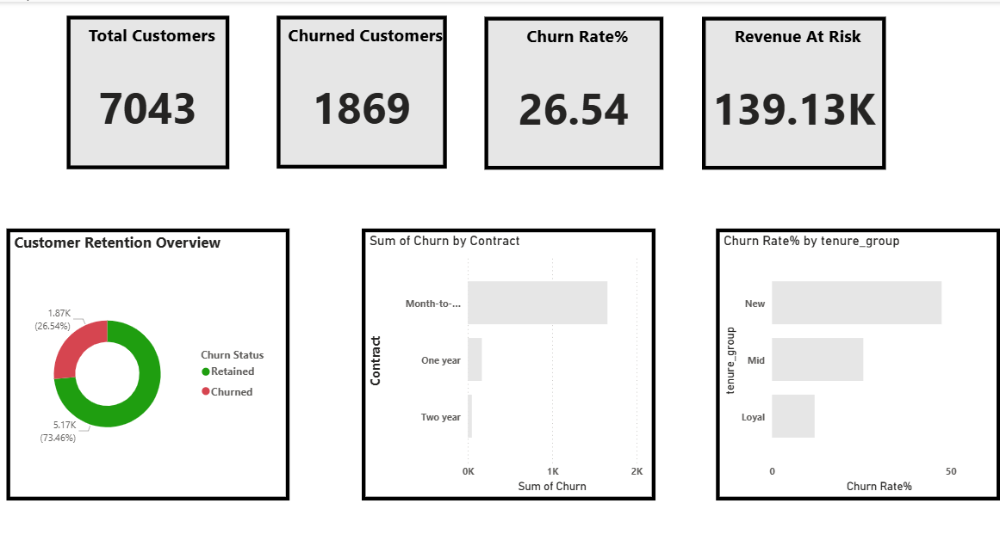

# 📉 Customer Churn Analysis

## 🎯 Business Problem
Customer churn leads to significant revenue loss, and many businesses struggle to identify which customers are at risk and why they leave.

---

## 📊 Objective
Analyze customer data to uncover key factors driving churn and identify high-risk customer segments.

---

## 🛠 Tools & Technologies
- Python (Pandas, NumPy)
- Data Cleaning & Analysis
- Data Visualization

---

## 🔍 Key Insights

- 📌 Customers with **low engagement levels showed significantly higher churn rates**
- 📌 Certain customer segments contributed disproportionately to churn
- 📌 **Usage patterns were strong indicators of retention vs churn**
- 📌 Pricing and plan structures influenced customer retention behavior

---

## 💡 Key Insight (Most Important)
👉 A small segment of low-engagement customers contributes to a large portion of churn risk.

---

## 🚀 Business Recommendations

- 🎯 Target high-risk customers with personalized retention strategies  
- 📈 Improve engagement for low-activity users  
- 💰 Optimize pricing and subscription plans based on customer behavior  
- 📊 Use predictive models to proactively reduce churn  

---

## 📈 Business Impact

This analysis enables businesses to:

- Reduce customer churn  
- Improve customer retention  
- Increase long-term revenue  
- Make data-driven decisions  

---

## 📸 Dashboard / Output

---

## 🔗 Project Link
[View Full Repository](https://github.com/Akshatadeshpande28/data-analytics-portfolio/tree/main/Churn%20Analysis)
