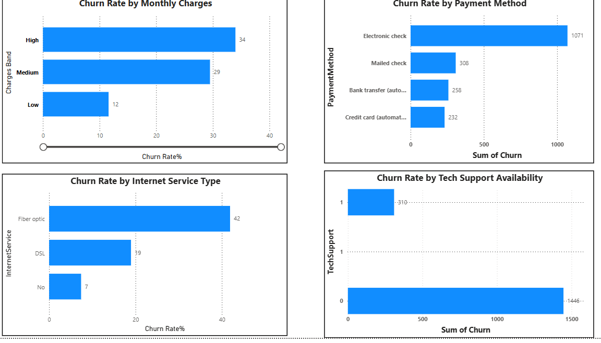
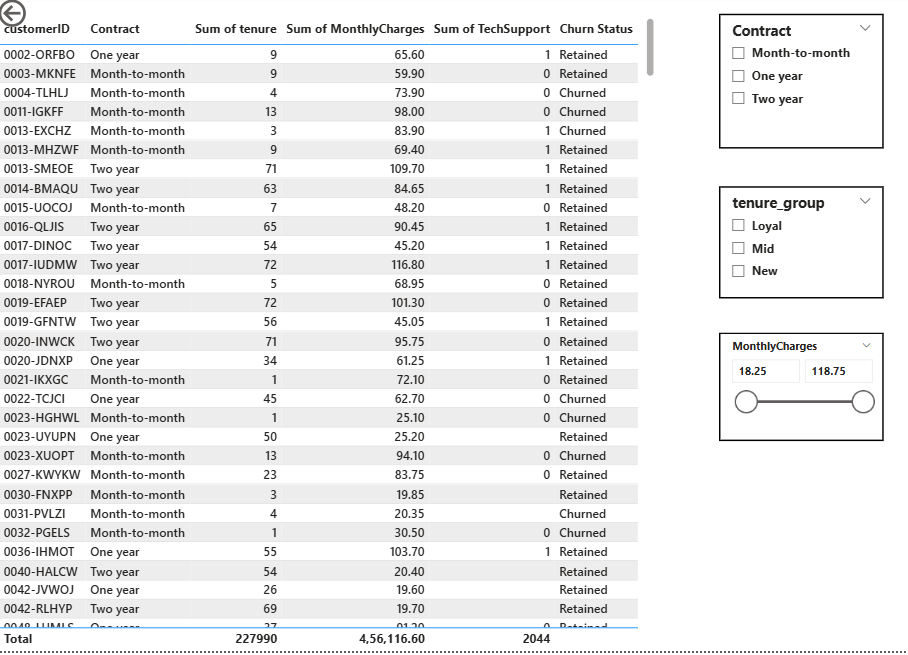

# 📉 Customer Churn Analysis

## 🎯 Business Problem
Businesses often lose customers without understanding the reasons behind churn, leading to revenue loss and reduced customer lifetime value.

---

## 📊 Objective
Analyze customer data to identify patterns and key factors contributing to churn.

---

## 🛠 Tools & Technologies
- Python (Pandas, NumPy)
- Data Analysis & Visualization

---

## 🔍 Key Insights

- 📌 Customers with low engagement showed higher churn rates  
- 📌 Certain customer segments contributed disproportionately to churn  
- 📌 Usage patterns strongly influenced retention  
- 📌 Pricing and plan differences impacted churn behavior  

---

## 💡 Key Insight (Most Important)
👉 Low-engagement customers contribute significantly to overall churn risk.

---

## 🚀 Business Recommendations

- 🎯 Target high-risk customers with retention campaigns  
- 📈 Improve engagement for low-activity users  
- 💰 Optimize pricing strategies  

---

## 📈 Business Impact

- Reduced churn  
- Improved retention  
- Increased long-term revenue  

---

## 📸 Dashboard Preview

