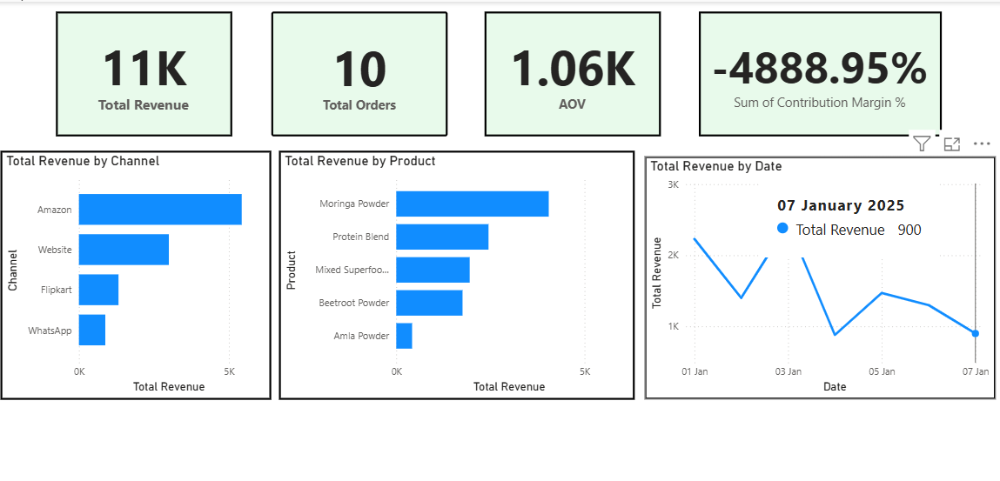
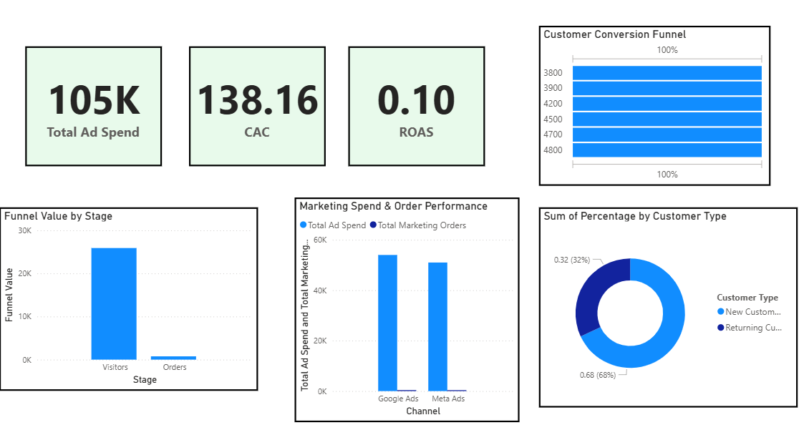
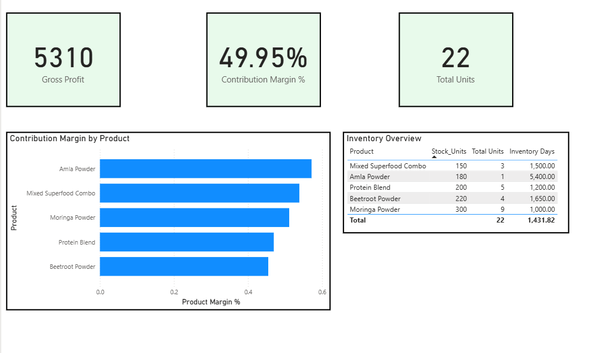

# 📊 D2C Multi-Channel Performance Dashboard

## 🎯 Business Problem
D2C brands operating across multiple channels (Amazon, Website, Flipkart, WhatsApp) often struggle to get a unified view of performance, leading to inefficient marketing, poor profitability tracking, and inventory risks.

---

## 📊 Objective
Build an interactive Power BI dashboard to track revenue, marketing efficiency, and profitability across channels and products.

---

## 🛠 Tools & Technologies
- Power BI  
- DAX Measures  
- Data Modeling  
- KPI Dashboard Design  

---

## 📈 Key Metrics Tracked

- Total Revenue  
- Total Orders  
- Average Order Value (AOV)  
- Customer Acquisition Cost (CAC)  
- Return on Ad Spend (ROAS)  
- Contribution Margin %  
- Gross Profit  
- Inventory Units  

---

## 📊 Dashboard Overview

### 📊 Revenue & Sales Performance Overview

**Key Insights:**
- 📌 Revenue is concentrated in a few key channels (Amazon dominates)
- 📌 Top products contribute majority of sales
- 📌 Sales show fluctuations over time

---

### 📊 Marketing Performance & Conversion Analysis

**Key Insights:**
- 📌 High marketing spend does not guarantee higher returns
- 📌 ROAS is low → indicating inefficient ad spend
- 📌 Conversion funnel highlights drop-offs in customer journey
- 📌 Majority customers are new vs returning

---

### 📊 Profitability & Inventory Insights

**Key Insights:**
- 📌 Contribution margins vary significantly across products
- 📌 High-margin products drive profitability
- 📌 Inventory data highlights slow-moving stock risk

---

## 💡 Key Insight (Most Important)
👉 Profitability is driven more by high-margin products and efficient marketing spend than total revenue.

---

## 🚀 Business Recommendations

- 🎯 Reallocate marketing budget to high-performing channels  
- 📈 Focus on promoting high-margin products  
- 💰 Optimize CAC and improve ROAS  
- 📦 Manage slow-moving inventory to reduce risk  

---

## 📈 Business Impact

This dashboard enables:

- Better marketing decision-making  
- Improved profitability  
- Data-driven inventory planning  
- Real-time performance tracking  

---

## ⚠️ Note
Data used is simulated for demonstration purposes.