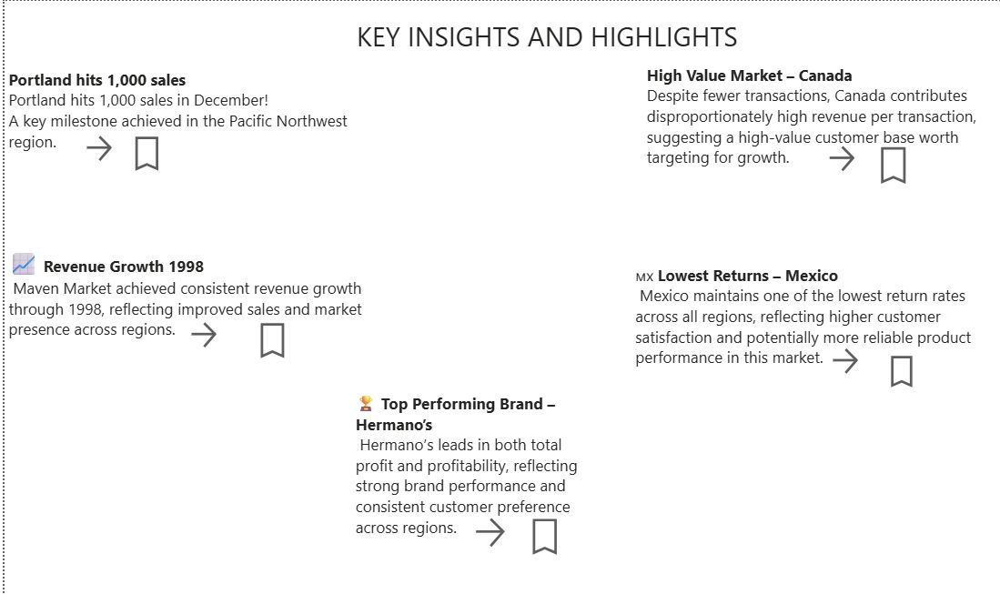
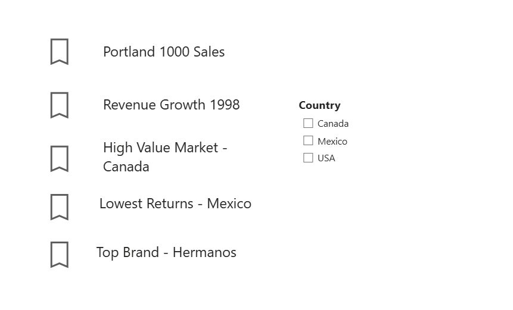
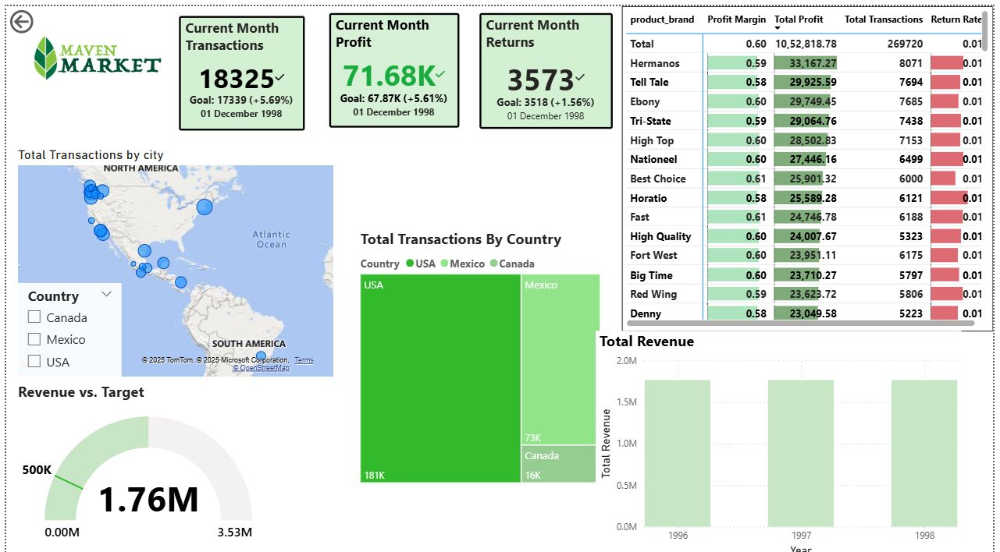

# 🛒 Maven Market Sales Analysis

## 🎯 Business Problem
Retail businesses struggle to identify which products, brands, and regions drive profitability.

---

## 📊 Objective
Analyze retail sales data to uncover key drivers of revenue and profit.

---

## 🛠 Tools
- SQL / Power BI
- Data Analysis

---

## 🔍 Key Insights

- 📌 Few products contribute majority of revenue  
- 📌 Some regions outperform others significantly  
- 📌 Certain brands have higher profitability  

---

## 💡 Key Insight
👉 Top-performing products and regions drive most of the business value.

---

## 🚀 Recommendations

- 🎯 Focus on high-performing products  
- 📈 Optimize underperforming regions  
- 💰 Promote profitable brands  

---

## 📈 Business Impact

- Increased sales efficiency  
- Better inventory planning  
- Improved decision-making  

---

## 📸 Dashboard Preview

