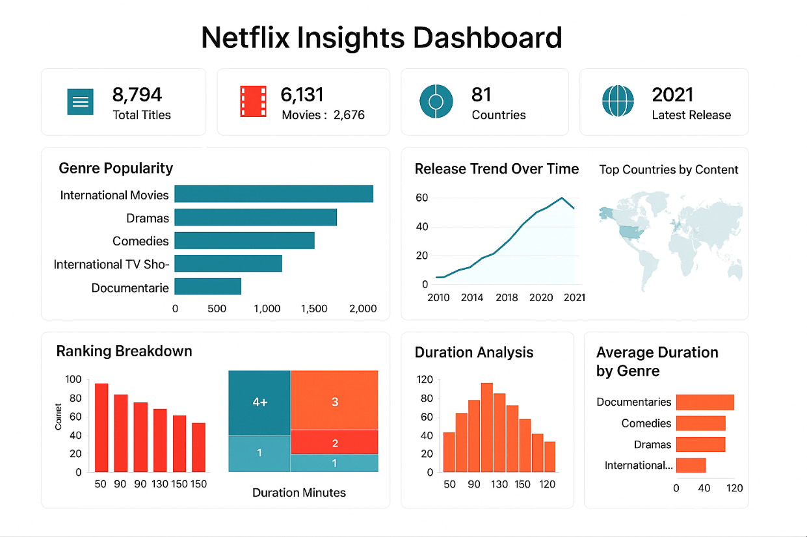

# 🎬 Netflix Content Strategy Analysis

## 🎯 Business Problem
Streaming platforms need to understand what content drives engagement to optimize strategy.

---

## 📊 Objective
Analyze Netflix dataset to identify trends in genres, content types, and engagement patterns.

---

## 🛠 Tools
- Python (Pandas, Matplotlib)
- Data Analysis

---

## 🔍 Key Insights

- 📌 Certain genres dominate content library  
- 📌 Movies vs TV shows distribution varies  
- 📌 Content trends change over time  

---

## 💡 Key Insight
👉 Popular genres significantly influence viewer engagement.

---

## 🚀 Recommendations

- 🎯 Invest in high-demand genres  
- 📈 Balance content types  
- 💡 Adapt strategy based on trends  

---

## 📈 Business Impact

- Better content strategy  
- Increased viewer engagement  
- Data-driven content planning  

---

## 📸 Visualizations

